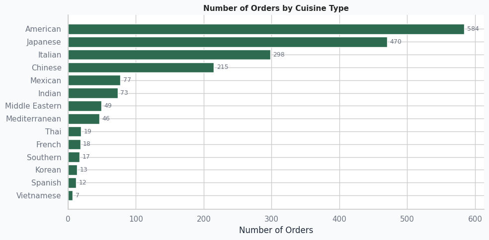
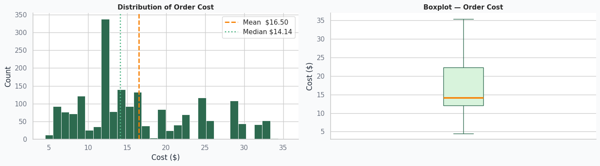
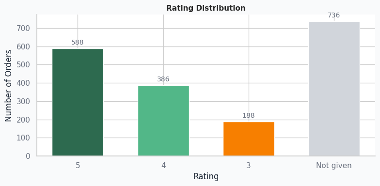

# 🍔 FoodHub Order Analysis (Exploratory Data Analysis)

## Overview

This project performs Exploratory Data Analysis (EDA) on FoodHub's online food ordering data to understand customer ordering behavior, cuisine preferences, delivery performance, and customer satisfaction.

The analysis provides business insights that can help improve customer experience, optimize operations, and support data-driven decision making.

---

## Business Problem

FoodHub is an online food delivery platform that partners with multiple restaurants to deliver food to customers.

The objective of this analysis is to understand:

- Customer ordering patterns
- Popular cuisines
- Delivery performance
- Customer ratings
- Factors influencing customer satisfaction

These insights can help FoodHub improve operational efficiency and enhance the overall customer experience.

---

## Objectives

- Explore the overall structure and quality of the dataset.
- Analyze order costs and customer spending patterns.
- Study food preparation and delivery times.
- Identify the most popular cuisines.
- Compare weekday and weekend ordering behavior.
- Analyze customer ratings.
- Discover relationships between different business variables.
- Generate actionable business recommendations.

---

## Dataset

The dataset contains information related to food orders, including:

- Order Cost
- Cuisine Type
- Food Preparation Time
- Delivery Time
- Day of the Week
- Customer Rating

---

## Project Workflow

1. Import Libraries & Load Data
2. Data Overview
3. Data Cleaning & Validation
4. Univariate Analysis
5. Bivariate Analysis
6. Business Insights
7. Key Takeaways & Recommendations

---

## Exploratory Analysis

### Univariate Analysis

- Cost of Order
- Food Preparation Time
- Delivery Time
- Cuisine Distribution
- Day of the Week
- Rating Distribution

### Bivariate Analysis

- Cost of Order vs Cuisine Type
- Cost of Order vs Day of Week
- Cost of Order vs Rating
- Food Preparation Time vs Delivery Time
- Delivery Time by Day of Week
- Cuisine Preference by Day of Week
- Rating vs Cuisine Type

---

## Key Business Insights

The analysis helps answer questions such as:

- Which cuisines are ordered most frequently?
- Do customers spend more on weekends?
- How long does food preparation typically take?
- Does delivery time affect customer ratings?
- Which cuisines receive the highest ratings?
- Are there differences between weekday and weekend ordering patterns?

---

## Business Recommendations

Based on the findings, FoodHub can:

- Promote high-demand cuisines.
- Optimize restaurant preparation times.
- Reduce delivery delays.
- Improve customer satisfaction through operational improvements.
- Design targeted marketing campaigns based on ordering behavior.

---

## Technologies Used

- Python
- Jupyter Notebook
- Pandas
- NumPy
- Matplotlib
- Seaborn

---

## Repository Structure

```
FoodHub_EDA/
│
├── FoodHub_EDA.ipynb
├── README.md
├── data
└── images
```

---

## Future Enhancements

- Interactive dashboard using Power BI or Streamlit
- Predictive analysis for delivery time
- Customer segmentation
- Restaurant performance analysis
- Recommendation system

---

## 🍽️ Most Popular Cuisines

The chart below highlights the most frequently ordered cuisines on the FoodHub platform, helping identify customer preferences and opportunities for targeted promotions.



---

## 💰 Order Cost Distribution

Understanding the distribution of order values helps identify customer spending patterns and supports pricing and promotional strategies.



---

## ⭐ Customer Ratings Distribution

Customer ratings provide valuable insights into overall satisfaction and service quality, helping identify opportunities to improve the customer experience.



---


## Author

**Preeti Sahu**

Data Analytics | Machine Learning | SQL | PySpark | Power BI | GenAI
